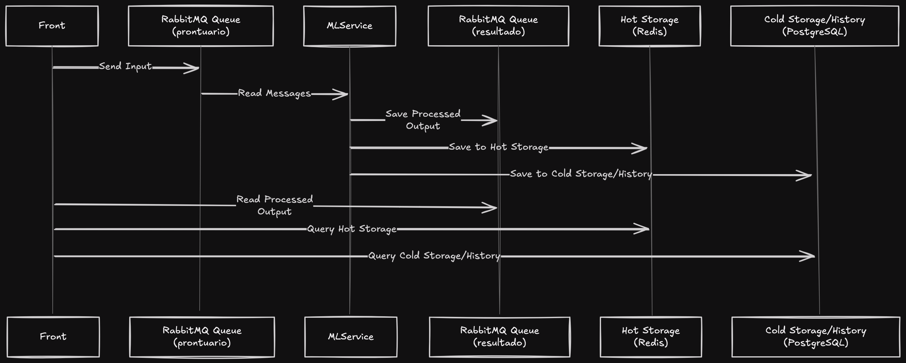

# Desafio Neural Med Caio
  

## MLService Folder Structure
```bash
└── ml_service
    ├── Dockerfile
    ├── main.py
    ├── requirements.txt
    ├── src
    │   ├── config.py
    │   ├── ml_service.py
    │   ├── model
    │   │   └── patient_data.py
    │   ├── ner_model.py
    │   └── repository
    │       ├── cold_storage_repository.py
    │       ├── hot_storage_repository.py
    │       └── rabbitmq_repository.py
    └── tests
        └── test_ml_service.py
```

- **main.py**: The runner of the project.
- **ml_service.py**: `MlService` class is the core class responsible for the complete pipeline, managing the flow from the input queue to the output queue and coordinating all other classes.
- **ner_model.py**: `NerModel` class which loads the model and makes predictions.
- **repository**: Classes responsible for database and queue integrations.


## Infra
-  **Front**: The frontend application used to send input messages, read output messages, query Redis, and query PostgreSQL.
-  **ML Service**: This service reads messages from the RabbitMQ queue, processes them with the NerModel, and saves the output to another queue, Redis, and PostgreSQL.
-  **Redis**: Acts as the hot storage for data.
-  **PostgreSQL**: Serves as the cold storage for data.
-  **RabbitMQ**: The main data integrator, from which the input is received and the output is sent.


## Architecture Diagram



## Quick Tutorial: Running the Services
1.  **Install Docker and Docker Compose**: Ensure you have Docker and Docker Compose installed on your machine.

2.  **Clone the Repository**: Clone this repository to your local machine.
```bash
git clone <repository-url>

cd desafio_neural_med_caio
```  

3.  **Start the Services**: Use Docker Compose to start all services.
```bash
docker-compose up
``` 

4.  **Access the Services**:
-  **RabbitMQ Management UI**: Open your browser and go to `http://localhost:15672` (default user: `guest`, password: `guest`).
-  **Frontend Application**: Access the frontend at `http://localhost:8501`.

5.  **Run UnitTests**: To run the unit tests for the ML Service, execute the following command:
```bash
docker-compose run --rm ml_service python -m unittest tests/*
```


## Demonstration


## Considerations:
[Click here](https://github.com/CaioSGoncalves/desafio_neural_med_caio/blob/main/consideracoes.md)
